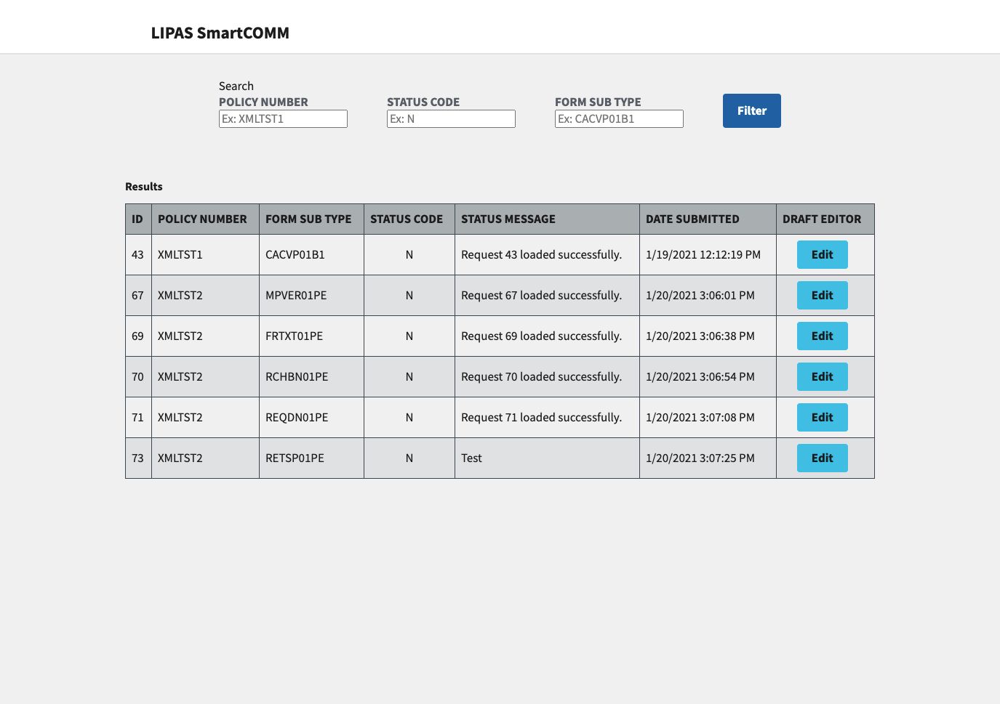
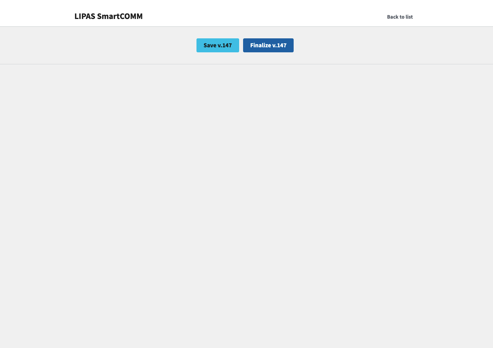
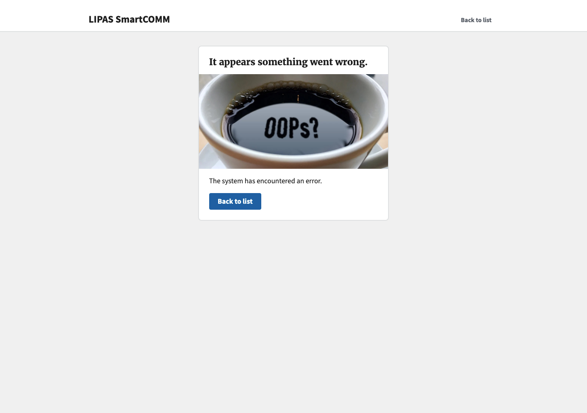

# LIPAS UI work

This is a repo for the html and css for the LIPAS project. This follows the [U.S. Web Design System](https://designsystem.digital.gov/)

## Preview

The list

The Editor

The error page

## Set up instructions

> Note: you must have yarn installed to run this project

To run the preview

1. Clone this repository `git clone https://github.com/mdewey/lipus-html.git`
2. `cd` into that directory
3. Run `yarn` to install dependencies
4. Run `yarn start` to launch the project.
